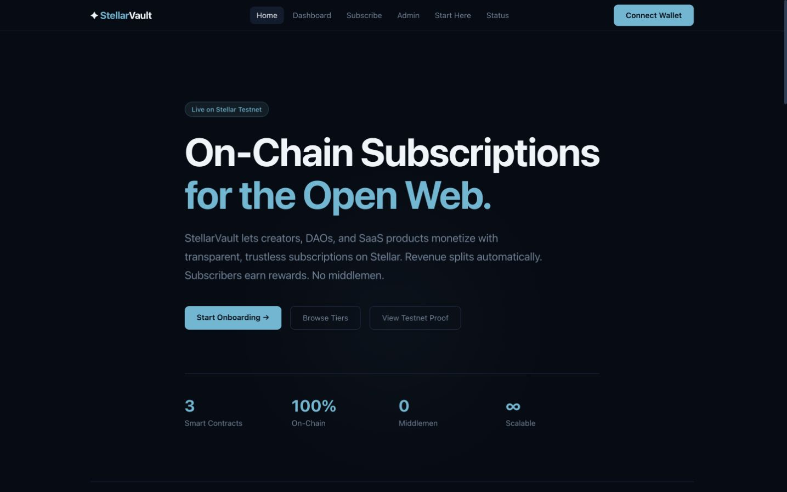
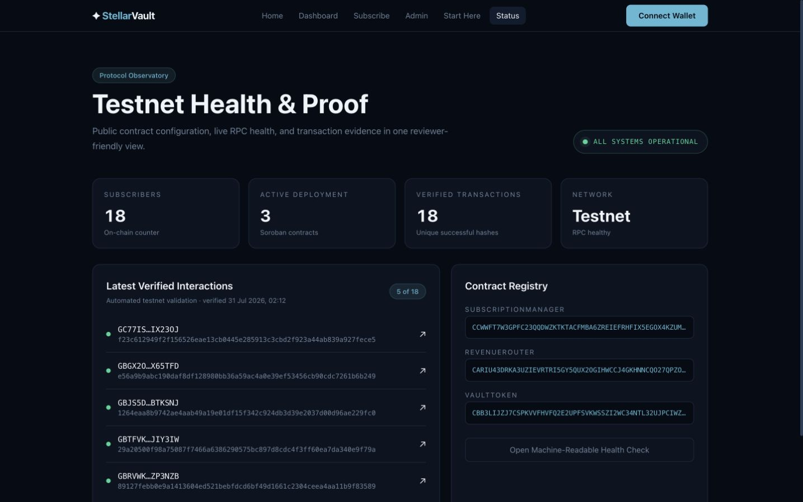
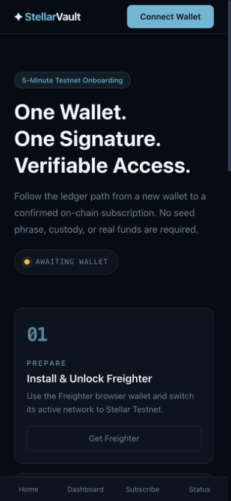
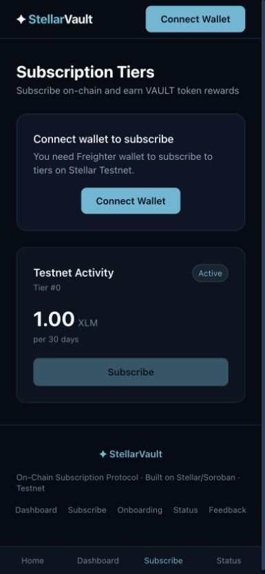

<div align="center">


<br /><br />

# ✦ StellarVault

### On-Chain Subscription & Revenue Sharing Protocol on Stellar/Soroban

**[🚀 Live Demo → stellar-vault-app.netlify.app](https://stellar-vault-app.netlify.app)**

<br />

</div>

---
## 📝 Feedback & Response Tracking

Help us improve StellarVault by submitting feedback through the form below. Responses are collected through the form and summarized anonymously.

- **[Open the feedback form](https://docs.google.com/forms/d/1etiCOf1ZtK_5LS3Re1RSLpIK6nK8cF7zJ_Q2XKOpzHs/viewform)**
- **[Read the anonymized feedback summary](./docs/USER_FEEDBACK.md)**

### Feedback addressed

The latest user responses highlighted three issues:

- **“The UI was lagging a bit.”** Dashboard reads now share a short-lived snapshot cache and deduplicate in-flight requests, reducing repeated Soroban RPC calls during navigation and refreshes.
- **“The wallet sometimes doesn’t recognize the Freighter wallet.”** Connection now retries detection, uses Freighter’s explicit access flow, watches for account changes, and reports network or extension state clearly.
- **“My wallet wasn’t connecting.”** The connect control now has a retry path, validates the returned address, checks the active network, and surfaces actionable error text instead of failing silently.

## 🏗️ Key Features & Architecture

StellarVault is a production-ready, fully on-chain subscription and payment splits protocol built on Stellar's Soroban smart contract platform. It enables SaaS platforms, DAOs, and content creators to monetize without middlemen, charge transparently, and route revenue splits instantly on-chain.

### 1. ⚙️ Advanced Smart Contract Development
Built in Rust using the Soroban SDK v21. State is managed via persistent storage with automated TTL extension to ensure subscription record durability. 
- **Subscription Lifecycle**: Handled via `subscribe()`, `renew()`, and `cancel()` flows in the [SubscriptionManager](./contracts/subscription_manager/src/lib.rs).
- **Stated Variables**: Holds admin mappings, vault token rewards metadata, and structured pricing tier configurations (`TierConfig`).

### 2. 🔗 Inter-Contract Communication
The protocol divides concerns among 3 independent contracts interacting atomically:
- **SubscriptionManager** acts as the core orchestrator. When a payment is made, it performs a cross-contract token transfer, routing the funds to the `RevenueRouter` address.
- **RevenueRouter** immediately runs split logic, dividing the fee among configured recipients.
- **VaultToken** is an SEP-41 compliant token. The manager performs a cross-contract `mint()` call to distribute loyalty reward tokens directly to the subscriber.

```
User (Freighter Wallet)
        │
        ▼
SubscriptionManager ──► RevenueRouter ──► Split Recipients (70/20/10)
        │
        └──────────────► VaultToken.mint(subscriber, reward_amount)
                                    ↑
                              VAULT tokens earned
                              on every payment
```

### 3. 📡 Event Streaming & Live Protocol Logs
Every ledger state change publishes standard Soroban events, allowing web application indexers and frontends to stream transactions in real-time.
- `subbed(subscriber, tier_id, expiry_ledger)`: Emitted on new subscription.
- `renewed(subscriber, tier_id, new_expiry)`: Emitted when renewing.
- `cancelled(subscriber, tier_id)`: Emitted on cancellation.
- `routed(token_address, splits)`: Emitted by the router on revenue split execution.

The dashboard displays a **Verified Testnet Activity Feed** backed by public Stellar Expert transaction hashes. The separate `/status` page reports live RPC health and on-chain counters.

### 4. 🧪 Comprehensive Testing Suite
16 unit tests are implemented across all contract crates, verifying edge cases, authentication restrictions, splits calculations, and token distribution rules.
- Run tests: `cargo test --workspace`

### 5. 🤖 Automated CI/CD Pipelines
GitHub Actions are configured under `.github/workflows/` to ensure production-level code quality:
- **Contract Tests & WASM Build** (`test.yml`): Compiles Rust files under 1.85.0 toolchain, validates WASM targets, and runs unit tests.
- **Testnet Deployment** (`deploy.yml`): Provides a manual, guarded contract upload, deployment, initialization, and artifact-validation workflow for Stellar Testnet.
- **Performance & Audits** (`lighthouse.yml`): Runs Google Lighthouse audits to enforce high performance and accessibility standards.

### 6. 📱 Responsive UI & Wallet Integration
- Built with **Next.js 16**, **TypeScript**, and **Tailwind CSS v4** styling.
- Works seamlessly on mobile viewports down to 375px.
- Connects securely with the **Freighter Wallet** to sign ledger transactions.
- Implements transaction locking/mutexes to prevent duplicate freighter wallet popups.
- Implements thorough error-handling and disabled inputs during transactions.

---

## 🌐 Live Contracts (Stellar Testnet)

| Contract | Address |
|---|---|
| **SubscriptionManager** | `CCWWFT7W3GPFC23QQDWZKTKTACFMBA6ZREIEFRHFIX5EGOX4KZUMCGCZ` |
| **RevenueRouter** | `CARIU43DRKA3UZIEVRTRI5GY5QUX2OGIHWCCJ4GKHNNCQO27QPZOFI22` |
| **VaultToken** | `CBB3LIJZJ7CSPKVVFHVFQ2E2UPFSVKWSSZI2WC34NTL32UJPCIWZFTWA` |

---

## ✅ Submission Evidence

### Submission form values

| Field | Value |
|---|---|
| **Project Name** | StellarVault |
| **GitHub Repo** | [github.com/gaurav190901/stellar-vault](https://github.com/gaurav190901/stellar-vault) |
| **Live Demo** | [stellar-vault-app.netlify.app](https://stellar-vault-app.netlify.app) |
| **Mainnet Transaction** | 0 |
| **Mainnet Contract Address** | Not deployed |
| **Testnet Traction** | 18 successful transactions from 18 unique automated test wallets; 18 subscribers; 18 XLM routed; 1,800 VAULT base units issued |
| **Testnet Contract Address** | SubscriptionManager: `CCWWFT7W3GPFC23QQDWZKTKTACFMBA6ZREIEFRHFIX5EGOX4KZUMCGCZ` |
| **Demo Video** | **Human recording and upload required** |
| **Feedback Form** | [Open public feedback form](https://docs.google.com/forms/d/1etiCOf1ZtK_5LS3Re1RSLpIK6nK8cF7zJ_Q2XKOpzHs/viewform) |

### Production MVP checklist

| Requirement | Status | Evidence |
|---|---|---|
| Fully functional production-ready MVP | Ready locally | Smart contracts, frontend, wallet flow, telemetry, and health endpoint |
| Stable frontend and smart contract architecture | Ready locally | Three-contract architecture and typed frontend integration |
| Mobile responsive UI | Ready locally | Responsive layout, mobile navigation, and screenshots below |
| Proper loading states and error handling | Ready locally | Route loading/error boundaries and transaction-level states |
| User onboarding | Ready locally | Guided `/onboarding` flow |
| Minimum 10 real users | **Human action required** | Complete the real-user evidence table below |
| Proof of wallet interactions | Automated proof complete | 18 public testnet transactions below |
| Basic user feedback collection | Ready | Public form and anonymized feedback summary above |
| Production deployment | Existing deployment; update after push | [Live Netlify application](https://stellar-vault-app.netlify.app) |
| Monitoring and analytics | Ready locally | `/status`, `/api/health`, `/api/telemetry`, Web Vitals, and client error reporting |
| Optimized user experience | Ready locally | Cached contract reads, deduplicated requests, responsive states, and clear wallet errors |
| Proper project structure and documentation | Ready locally | Root README, deployment guide, evidence, and demo instructions |
| Smart contracts deployed on Stellar Testnet | Complete | All three contract addresses are listed above |
| Minimum 15+ meaningful commits | Complete | Public repository history contains more than 15 commits |
| Public GitHub repository | Complete | [gaurav190901/stellar-vault](https://github.com/gaurav190901/stellar-vault) |
| Live demo link | Complete | [stellar-vault-app.netlify.app](https://stellar-vault-app.netlify.app) |
| Contract deployment address | Complete | SubscriptionManager address listed above |
| Product, mobile, and monitoring screenshots | Complete | Screenshots are embedded below |
| Live demo video | **Human action required** | Follow the recording script below and add its public URL here |
| Team review | Pending reviewer action | Review technical complexity, product quality, architecture, and usefulness |

### Verified testnet traction

- **Network:** Stellar Testnet
- **Validation date:** July 31, 2026
- **Tier:** Tier 0 — “Testnet Activity”
- **Price and duration:** 1 XLM for 30 days
- **Successful transactions:** 18 of 18
- **Unique public test wallets:** 18
- **On-chain subscriber counter:** 18
- **Revenue routed:** 18 XLM
- **VAULT rewards issued:** 1,800 base units
- **Downloadable evidence:** [CSV transaction log](./evidence/testnet-wallet-interactions.csv)
- **Live monitoring:** [Protocol health and proof](https://stellar-vault-app.netlify.app/status)

These 18 wallets are automated Stellar Testnet validation wallets. They prove end-to-end contract behavior, but they are **not** represented as 18 real human users. No wallet secret keys, recovery phrases, GitHub credentials, or personal information are stored in this repository.

| # | Public wallet | Successful transaction |
|---:|---|---|
| 1 | `GDW3W6SR3CPMQXN4A6VPH5JG4DO7BQPHPW4WYTO4TPNN6PLMAKOG3OK3` | [`c92e670a…edc594`](https://stellar.expert/explorer/testnet/tx/c92e670a09c8592979db4184e6f4c85018e4502b0c7a6752061c3807ffedc594) |
| 2 | `GCERNYPYDYDPGDDDAOG3NUOHQPFOU5I7A3SWLHNYTGVLPGZJ2SYT5HGX` | [`ea2746b3…8b7158`](https://stellar.expert/explorer/testnet/tx/ea2746b3ba0ec9abe0f15b502c5576390465960432a511b99a0c0d70498b7158) |
| 3 | `GCT7LRGIFBZOPUZ5YIBKG4CBRU2SYT7WG2YVHM6C3IHZ2HBHCBW2RLUU` | [`c1948fc0…572468`](https://stellar.expert/explorer/testnet/tx/c1948fc0694a50ed0d5a646811bf888a6280050b41415011bc0925b3de572468) |
| 4 | `GBYJFELTV2WDNABYD6XFYRFW3ACCNKXSDKNY7R34KKBNRUXQZZ4YPJN4` | [`2dd7b56e…bb51d1`](https://stellar.expert/explorer/testnet/tx/2dd7b56ed78b1697c5ab781dc5bbf9b4f8f7501971381a76b5f7e7c4a6bb51d1) |
| 5 | `GBQVS4T6C2QJADQ3ABQXXGPU2QYERTK46VXMY5SGCGAAOS3LLYGYQLHX` | [`ff0cb2d0…ff26c`](https://stellar.expert/explorer/testnet/tx/ff0cb2d0521b755785783485af2ce01960466a9225ab2d2133547295d44ff26c) |
| 6 | `GAJDC2CFNBH7NJVJUAFRYCNE4LUNFUJVMM2ZLFZINRP46O3JPBG7TKR4` | [`6bbb1533…6679b`](https://stellar.expert/explorer/testnet/tx/6bbb1533d0914f937c65ab20dd1b27a63871d675bd1932877887e917baa6679b) |
| 7 | `GDIM7MOXHNBSC5YCL7VUVFSRTTLNKS2BLKAAIJWCRY334W5SGVJZN72W` | [`3179fa8a…cd3566`](https://stellar.expert/explorer/testnet/tx/3179fa8a245af494c8ba66bbce51c3f1dcf38873189439896ff8725eeecd3566) |
| 8 | `GCJHWBYPXURTZ5L6UHSJJZWGJ22A5I7MTV7BAR7N475H4DT3IVBZI7PT` | [`fe46a8c8…3a950`](https://stellar.expert/explorer/testnet/tx/fe46a8c83cd90e41aa512b011947045becf731c9877894650f792e218d33a950) |
| 9 | `GCBTS3TX3DZFEGIB2CEJTLUI52CPYWF3J5ZJSEGFAHFJYFDI3ST7AKQA` | [`1f38e10a…725787`](https://stellar.expert/explorer/testnet/tx/1f38e10add3119a20d130cd10273a24a8a937160a118eb0842ea19e257725787) |
| 10 | `GAQBIKJM4CMPTYUO5EQC5VYTQFYOGVVLNZ5CBRCQ7LLIRJVFYWJJRDW5` | [`73e0c23f…6093b9`](https://stellar.expert/explorer/testnet/tx/73e0c23f998eb92736fc96354d67b748b8d00993a09381f75f985de28e6093b9) |
| 11 | `GCWALQPYPIOOC5L2ACNBL5YR4NU67L4B22XBAQTDSTRWQDZM6EAQSDB6` | [`6d29b408…92001c`](https://stellar.expert/explorer/testnet/tx/6d29b408f91b2ae7cd3087be75c98185844aa704c376b0963a23b6f85692001c) |
| 12 | `GCHIIGJL7ZSRBFMJV6VMOSHP7MQDY23UOP3YKQ6FVMCPTS7E7XPFEIDO` | [`bab6e8ce…f89c0f`](https://stellar.expert/explorer/testnet/tx/bab6e8ceec5378be56bf5bbba2f1c927db11899fa2eff5456c5eb16d2ef89c0f) |
| 13 | `GAJX7GHV5XD37JEGRC4AFCNLEI6RN3ML4IIWNUYR2UZAOY3YBNRQZ5XS` | [`c6d632c1…66a32f`](https://stellar.expert/explorer/testnet/tx/c6d632c1aab87fea49214d0edff47e6354a48a40780295fbf29b2acdd466a32f) |
| 14 | `GBRVWKCFUIM2SZNRS66ASHWYIZS6MXJXBBWT27YOIRLTHTY2HYZP3NZB` | [`89127feb…83589`](https://stellar.expert/explorer/testnet/tx/89127febb0e9a1413604ed521bebfdcd6bf49d1661c2304ceea4aa11b9f83589) |
| 15 | `GBTFVKSVDIT4Q4TOVOZB5RBCSXCKXEVXZY2P474URI3RV5E2NEJIY3IW` | [`29a20500…9f79a`](https://stellar.expert/explorer/testnet/tx/29a20500f98a75087f7466a6386290575bc897d8cdc4f3ff60ea7da340e9f79a) |
| 16 | `GBJS5DMS35D6BBGFUKPJKJ75MPGBX7UGR2Q5P44NOSWV5WHBKXBTKSNJ` | [`1264eaa8…229fc0`](https://stellar.expert/explorer/testnet/tx/1264eaa8b9742ae4aab49a19e01df15f342c924db3d39e2037d00d96ae229fc0) |
| 17 | `GBGX2OEWIIN7HV6WBFLYIJDZDAWQZ2AXZKMO5VCSBMAFAIAFYVX65TFD` | [`e56a9b9a…6b249`](https://stellar.expert/explorer/testnet/tx/e56a9b9abc190daf8df128980bb36a59ac4a0e39ef53456cb90cdc7261b6b249) |
| 18 | `GC77ISYZVKGR3RD25UNILXA2AIATAMNAQAJBXXU5IROE5ANES6IX23OJ` | [`f23c6129…fece5`](https://stellar.expert/explorer/testnet/tx/f23c612949f2f156526eae13cb0445e285913c3cbd2f923a44ab839a927fece5) |

### Real-user onboarding and evidence collection

The submission requires at least 10 distinct **real people**. Each tester must:

1. Open the live product and follow `/onboarding`.
2. Connect a Freighter wallet configured for Stellar Testnet.
3. Complete one meaningful action, preferably a subscription.
4. Copy the public successful transaction hash.
5. Submit the feedback form and consent to including the public proof.

Do not record names, emails, recovery phrases, private keys, one-time codes, or GitHub credentials.

| Tester | Public wallet | Transaction hash | Date | Feedback received | Consent to include proof |
|---|---|---|---|---|---|
| 01 |  |  |  | No | No |
| 02 |  |  |  | No | No |
| 03 |  |  |  | No | No |
| 04 |  |  |  | No | No |
| 05 |  |  |  | No | No |
| 06 |  |  |  | No | No |
| 07 |  |  |  | No | No |
| 08 |  |  |  | No | No |
| 09 |  |  |  | No | No |
| 10 |  |  |  | No | No |

Mark this requirement complete only when all 10 rows have a distinct public wallet, successful public transaction hash, feedback response, and explicit consent. Before final submission, add only an anonymized feedback-response count and collection date; never publish respondent emails or private credentials.

### Live demo recording script

Target length: 2–3 minutes.

1. **Opening — 15 seconds:** Show the home page, explain the problem, and identify Stellar Testnet.
2. **Onboarding — 25 seconds:** Open `/onboarding`, show the Freighter/Testnet steps, and connect a funded test wallet.
3. **Subscription — 45 seconds:** Open `/subscribe`, choose Tier 0, sign in Freighter, wait for confirmation, and open the Stellar Expert link.
4. **Creator view — 30 seconds:** Open `/dashboard` and show the subscriber total, tier data, revenue split, and verified activity.
5. **Monitoring and architecture — 30 seconds:** Open `/status` and show RPC health, all three contract addresses, and the 18 verified interactions.
6. **Feedback and close — 15 seconds:** Show the feedback link and explain the real-user onboarding process.

Record at 1080p with wallet secrets and browser account menus hidden. Upload the finished video and replace the **Human recording and upload required** placeholder above with its public URL.

### Verification completed

- `cargo test --workspace` — **16 of 16 contract tests passed**
- `pnpm --dir frontend build` — **production frontend build passed**
- Desktop and 390px mobile browser checks — **no console errors or horizontal overflow**
- Testnet evidence — **18 of 18 successful transactions with 18 unique public wallets**
- Repository secret scan — **no private wallet keys or credentials included**
- Workflow YAML, deployment shell syntax, and repository whitespace checks — **passed**

The standalone [submission checklist](./SUBMISSION.md), [evidence notes](./evidence/README.md), [real-user runbook](./docs/USER_TESTING.md), [feedback summary](./docs/USER_FEEDBACK.md), and [demo script](./docs/DEMO_SCRIPT.md) remain as downloadable supporting documents, but all submission-critical information is also included directly in this README.

---

## 📦 Project Structure

```
stellarvault/
├── contracts/
│   ├── vault_token/            # SEP-41 token — VAULT rewards
│   ├── revenue_router/         # Basis-point revenue splitting
│   └── subscription_manager/   # Core subscription logic
├── frontend/
│   ├── app/
│   │   ├── page.tsx            # Landing page
│   │   ├── dashboard/          # Creator dashboard (live splits, stats, activity feed)
│   │   ├── subscribe/          # Subscriber tier explorer & cancellation
│   │   ├── admin/              # On-chain admin settings (splits & reward rate config)
│   │   ├── onboarding/         # Freighter and Stellar Testnet onboarding
│   │   ├── status/             # Live RPC health, contracts, and testnet proof
│   │   └── api/                # Health and anonymous telemetry endpoints
│   ├── components/             # Freighter connection, modals, tables, and charts
│   ├── lib/contracts.ts        # Soroban client integration & SDK wrapper
│   └── hooks/                  # useWallet & useDashboard
├── docs/                       # Deployment, user testing, demo, feedback, screenshots
├── evidence/                   # Public testnet transaction proof and CSV
├── scripts/
│   ├── deploy.sh               # Compile & deploy scripts
│   └── initialize.sh           # Configure parameters on-chain
└── .github/workflows/          # CI/CD validation actions
```

---

## 🚀 Quick Start & Development

### Run Tests
```bash
cargo test --workspace
```

### Build Frontend
```bash
cd frontend
pnpm install
pnpm dev
# → http://localhost:3000
```

---

## 📸 Screenshots

Fresh desktop, mobile, onboarding, and monitoring screenshots are stored in [`docs/screenshots`](./docs/screenshots) after the latest verification run.

### Latest verified build





### Mobile onboarding and subscription






### Mobile view


---

## 📄 License

MIT © [gaurav190901](https://github.com/gaurav190901)

## Contributors

- [gaurav190901](https://github.com/gaurav190901)
